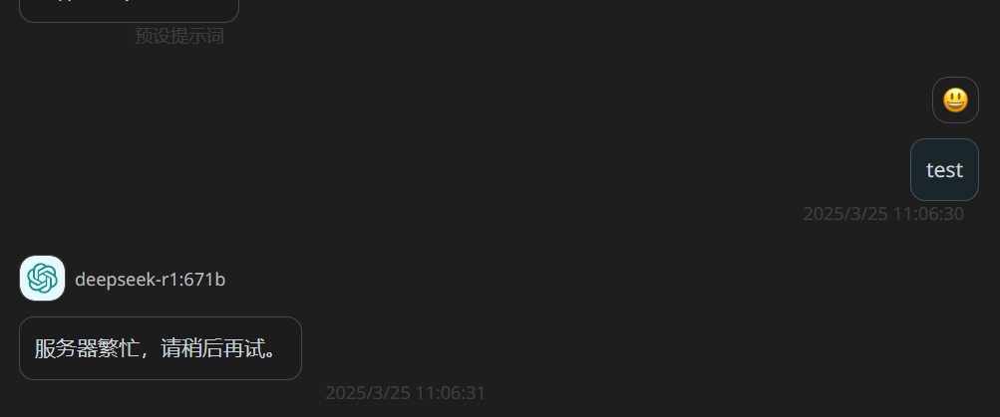

# Ollama-Honeypot 蜜罐
The Honeypot of Ollama 

chat/completions的 Inference API均已经实现

Ollama和OpenAI兼容的查询格式都可以正常使用

```

	// Inference
	r.GET("/api/ps", PsHandler)
	r.POST("/api/generate", GenerateHandler)
	r.POST("/api/chat", ChatHandler)
	r.POST("/api/embed", EmbedHandler)
	r.POST("/api/embeddings", EmbeddingsHandler)

	// Inference (OpenAI compatibility)
	r.POST("/v1/chat/completions", ChatMiddleware(), ChatHandler)
	r.POST("/v1/completions", GenerateHandler)
	r.POST("/v1/embeddings", EmbedHandler)
	r.GET("/v1/models", ListMiddleware(), ListHandler)
	r.GET("/v1/models/:model", RetrieveMiddleware(), ShowHandler)

```


可以使用OAI和Ollama的API接口进行“推理”

`baseURL := os.Getenv("OPENAI_BASE_URL") // 没设置BASE URL 只会回复fake`

`export OPENAI_BASE_URL=http://127.0.0.1:8000/v1/`

模型名字统一是**deepseek-reasoner**，vllm启动参数设置`--served-model-name deepseek-reasoner`即可

> 可以整点挂羊头卖狗肉的操作

